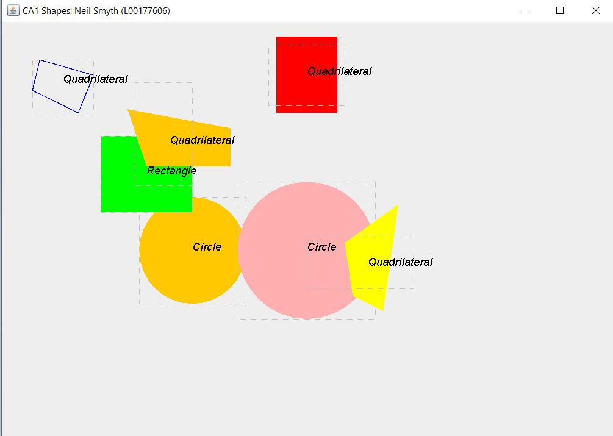

<h1 align="center">CA1 - Software Development: Java OOP </h1>

<h2 align="center">Shapes GUI </h2>

*Student Name and Number: Neil Smyth (L00177606)*

## **Project Brief**

The CA1 is aimed getting the students to use and implement a program 
using the OOP principles via the Java programming language. We utilised Java Swing
to visualise our code. The goal of the application is display, move and rotate different shapes that we have created.

Starting with the concept of an abstract Shapes class, which the shapes themselves (Circle, Rect) inherited from, was
a solid starting point to build the project and utilise OOP principles. As well as abstraction, we encountered Interfaces via Moveable and Rotation methods,
polymorphism, encapsulation and inheritance. I felt the project was a good learning curve and I am pleased with the outcome.Below are some examples:
1. Abstraction
```java
public abstract class Shape
```
2. Encapsulation (e.g. access modifiers):
```java
protected boolean filled; //protected instance field so child classes can access
```
3. Inheritance (e.g. extends ):
```java
protected boolean filled; //protected instance field so child classes can acces
// or also
private int x; // cannot access from outside class unless there's a 'getter' for example
```
4. Polymorphism (e.g. overriding methods):
```java
 @Override
    public void drawShape(Graphics g) {
        g.drawRect(pointX, pointY, width, height);
        }
```
5. Interfaces (Moveable and Rotation methods):
```java
public interface Rotatable {
    void rotateNinetyDegrees();
}

// Implemented in a class (e.g Quadrilateral)

public class Quadrilateral extends Shape implements Rotatable {
    // whereby we are forced to override the implemenation

    @Override
    public void rotateNinetyDegrees() {
        // code 
    }
    
}


```
### *Note for  Tester*

*For the **testing purposes**, please refer to the guiTester.Java class which calls the WindowCreator.buildWindow();, which is where 
the test shape objects have been created and invoked via the addSHapes method to the shapeManager, which in turn adds them on the panel 
```java
public class guiTester {

    /* global shapesManager object */
    static ShapesManager shapesManager = new ShapesManager();

    public static void main(String[] args) {

        WindowCreator.buildWindow();
    }
```


### GUI (Java Screen)

See below for an image of how the render GUI looks (Java Swing). A User can toggle or un-toggle the filled colour of the shape, 
by clicking the right mouse button. The user must click inside of the dotted bounding box to see the affects. If a user left-clicks the mouse
button, then, if it's a Rectangle shape, the shape will move by 10 units to the right. If the shape is a Quadrilateral, it will rotate on 
it's center point by 90 degrees. Circles currently don't move (and rotation wouldn't be much use).





## Potential Improvements

I only saw the test 2 code via Dermot quite late, so I was unable to update my Quadrilateral constructor to include the rotation to start 
at a particular point. This is something I will build in the future.

## Credits
ATU Donegal Software Development Course Material 

### Final Points

Written by Neil Smyth (L00177606). 

Thanks very much and please reach out if more information is needed.

> NOTE: This project was created for educational purposes.